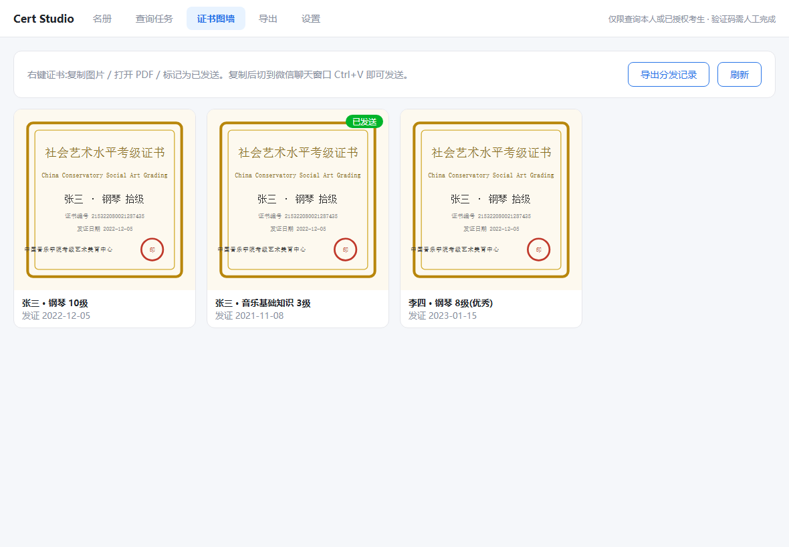
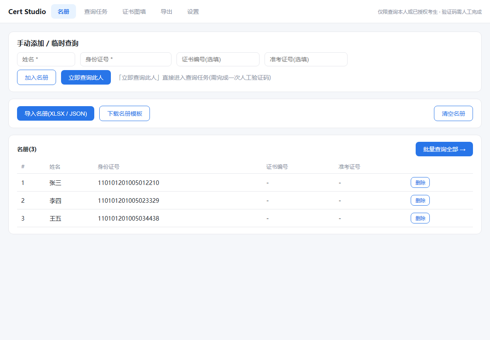
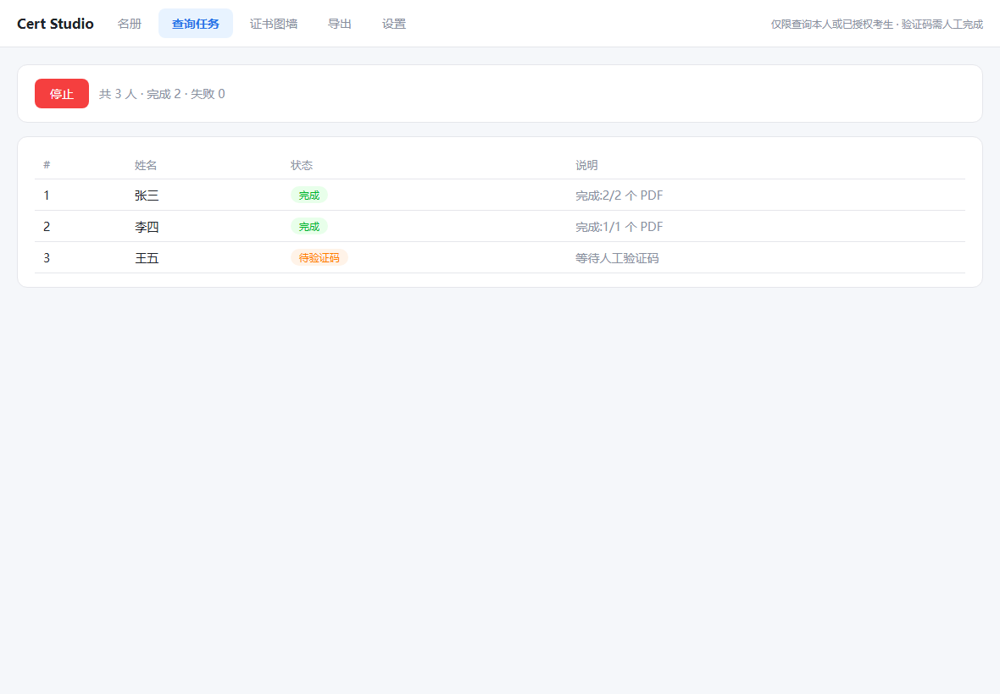
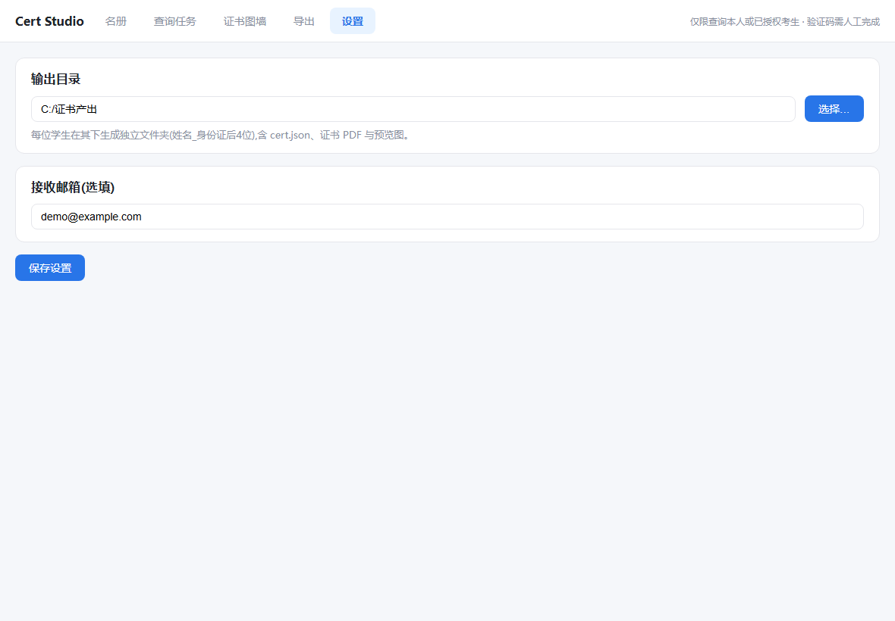

<div align="center">

# Cert Studio

**[中文](#功能) | [English](#features)**

中国音乐学院考级证书批量获取与分发工具(本地桌面应用)

Batch certificate query & distribution tool for China Conservatory grading exams (local desktop app)



</div>

---

## 功能

> **合规声明**
> - 本工具仅限查询**本人**或**已获得授权**(家长/机构协议)考生的证书信息,请遵守《个人信息保护法》(PIPL)及官方平台服务条款。
> - 验证码由人工完成,本工具**不包含任何验证码识别/绕过逻辑**。
> - 请求自带限速与随机间隔,请勿高频批量抓取。
> - 官方接口如变更,本工具可能失效;作者不对其持续可用性作承诺。
> - 产出文件与 OSS 直链路径包含身份证信息,**请勿外传**。

### 证书图墙

每张证书展示为预览图卡片,右键操作:

- **复制图片** → 切到微信聊天窗口 Ctrl+V 直接发送给家长
- **打开 PDF** → 查看正式电子证书文件
- **标记为已发送** → 记录分发状态,卡片显示「已发送」角标,防止漏发/重发
- 导出分发记录 XLSX(发送时间/学生/专业/级别/证书编号)



### 名册管理

- **手动添加 / 临时查询**:填姓名 + 身份证号,可单独查一个人,也可加入名册
- **导入名册**:XLSX / JSON(必填列:姓名、身份证号;选填:证书编号、准考证号),示例见 [`examples/roster.sample.json`](examples/roster.sample.json)
- 单行删除、一键清空、批量查询全部



### 批量查询

逐个学生:自动取票 → 弹出官方旋转验证码(**人工拖动**) → 查询 → 自动触发 PDF 生成并轮询下载。票据过期自动换票重试;学生之间随机限速。

### 汇总导出

全部证书记录导出 XLSX:姓名 / 专业 / 级别 / 证书编号 / 准考证号 / 发证日期 / 考试时间 / 考试方式 / 等次 / 状态。

### 产出目录结构

```
<输出目录>/
├── distributions.json          # 分发记录
├── 张三_2210/
│   ├── cert.json               # 官方接口原始返回
│   ├── 钢琴10级_215322080021287435.pdf
│   └── 钢琴10级_215322080021287435.png    # 预览图(微信分发用)
└── 李四_3329/
    └── ...
```

## 下载 / 安装

| 平台 | 文件 |
|---|---|
| Windows x64 | `CertStudio-*-win.exe`(便携版,双击即用) |
| Windows ARM64 | `CertStudio-*-win-arm64.exe` |
| macOS x64 / Apple Silicon | `CertStudio-*.dmg`(CI 自动构建,见 Releases) |
| Linux x64 / ARM64 | `CertStudio-*.AppImage`(同上) |

Windows 安装包见 [Releases](../../releases);macOS / Linux 包由 [GitHub Actions](.github/workflows/build-release.yml) 在打 tag 时自动构建并附加到 Release。

### 开发

```bash
npm install      # Node 20+;国内网络建议配置代理或 npm 镜像
npm run dev      # vite + electron 开发模式
npm run build    # 类型检查 + 打包
```

Electron 主进程在 `electron/`,渲染层 React 在 `src/`,IPC 通道见 `electron/preload.ts`。

## 接口说明(2026-08 实测)

官方查询站 `ccmkjzx002.zgyyxykj.com/search_cert`,请求需带 `Referer` 与浏览器 UA:

| 接口 | 方法 | 参数 | 说明 |
|---|---|---|---|
| `/admins/index/get_captcha_check_key` | GET | - | 一次性票据,有效期约 1-2 分钟 |
| `capt.zgyyxykj.com/captcha?key=` | - | key | 旋转验证码 iframe;完成后 postMessage `on_captcha_success` |
| `/search_cert/index/search_cert` | POST | name, id_card, cert_no, exam_no, captcha_check_key | 票据须已通过验证,过期返回 `{"error":5}` |
| `/search_cert/index/request_pdf` | POST | cert_no, season(=apply_year+is_summer), id_card, email | 无验证码;`pdf_complete_time` 后重发返回 OSS `pdf_url` + `preview_img` |

查询结果 `exam_way` 索引:`0=现场考试, 1=视频考试, 2=音基考试, 3=AI智慧考试`;`is_summer`:`1=夏季, 3=春季, 4=暑假, 5=寒假, 0=冬季, 2=秋季`。

## License

MIT

---

<div align="center">



</div>

# Features

> **Compliance notice**
> - Use this tool only to query certificates of **yourself** or students you are **authorized** to query (parental / institutional consent). Comply with China's PIPL and the platform's terms of service.
> - The CAPTCHA is completed **manually by a human**. This tool contains **no captcha recognition or bypass logic**.
> - Requests are rate-limited with random jitter. Do not scrape aggressively.
> - The official API may change at any time; this tool may stop working, and the authors make no uptime promise.
> - Output files and OSS direct links contain ID numbers. **Do not share them publicly.**

### Certificate Wall

Each certificate renders as a preview card with right-click actions:

- **Copy image** → switch to WeChat, Ctrl+V to send to a parent
- **Open PDF** → view the formal e-certificate
- **Mark as sent** → records distribution status with a "sent" badge to avoid missed/duplicate sends
- Export the distribution log as XLSX (time / student / major / level / cert no.)

### Roster

- **Manual add / single query**: type a name + ID number to query one student instantly, or add to the roster
- **Import**: XLSX / JSON (required: name, ID number; optional: cert no., exam no.). See [`examples/roster.sample.json`](examples/roster.sample.json)
- Per-row delete, clear all, batch query

### Batch Query

For each student: fetch ticket → show the official rotate-captcha (**solved manually**) → query → trigger PDF generation and poll for download. Expired tickets auto-retry; students are spaced with random delays.

### Export

Export all certificate records to XLSX: name / major / level / cert no. / exam no. / issue date / exam session / exam mode / grade / status.

### Output layout

```
<output dir>/
├── distributions.json          # distribution log
├── 张三_2210/
│   ├── cert.json               # raw API response
│   ├── 钢琴10级_215322080021287435.pdf
│   └── 钢琴10级_215322080021287435.png    # preview image for WeChat
└── ...
```

## Download / Install

| Platform | File |
|---|---|
| Windows x64 | `CertStudio-*-win.exe` (portable) |
| Windows ARM64 | `CertStudio-*-win-arm64.exe` |
| macOS x64 / Apple Silicon | `CertStudio-*.dmg` (CI-built, see Releases) |
| Linux x64 / ARM64 | `CertStudio-*.AppImage` (same) |

Windows installers are attached to [Releases](../../releases); macOS / Linux artifacts are built automatically by [GitHub Actions](.github/workflows/build-release.yml) on tags.

### Development

```bash
npm install      # Node 20+
npm run dev      # vite + electron dev mode
npm run build    # typecheck + package
```

## API notes (as tested 2026-08)

Official site `ccmkjzx002.zgyyxykj.com/search_cert`; requests need `Referer` and a browser UA:

| Endpoint | Method | Params | Notes |
|---|---|---|---|
| `/admins/index/get_captcha_check_key` | GET | - | One-time ticket, valid ~1-2 min |
| `capt.zgyyxykj.com/captcha?key=` | - | key | Rotate-captcha iframe; posts `on_captcha_success` when solved |
| `/search_cert/index/search_cert` | POST | name, id_card, cert_no, exam_no, captcha_check_key | Ticket must be verified; expired → `{"error":5}` |
| `/search_cert/index/request_pdf` | POST | cert_no, season(=apply_year+is_summer), id_card, email | No captcha; re-request after `pdf_complete_time` for OSS `pdf_url` + `preview_img` |

`exam_way` values: `0=in-person, 1=video, 2=music-theory, 3=AI proctored`; `is_summer`: `1=summer, 3=spring, 4=summer break, 5=winter break, 0=winter, 2=autumn`.

## License

MIT
